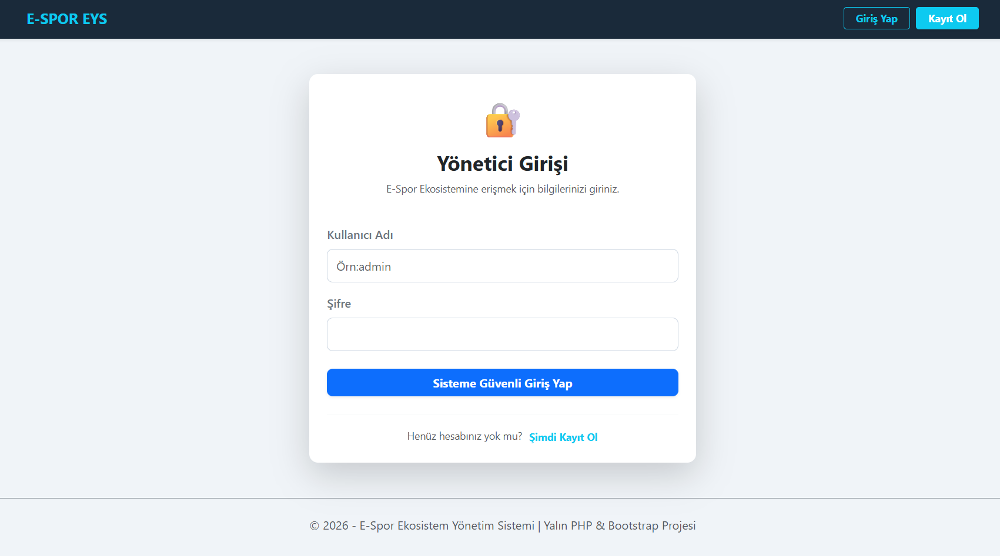
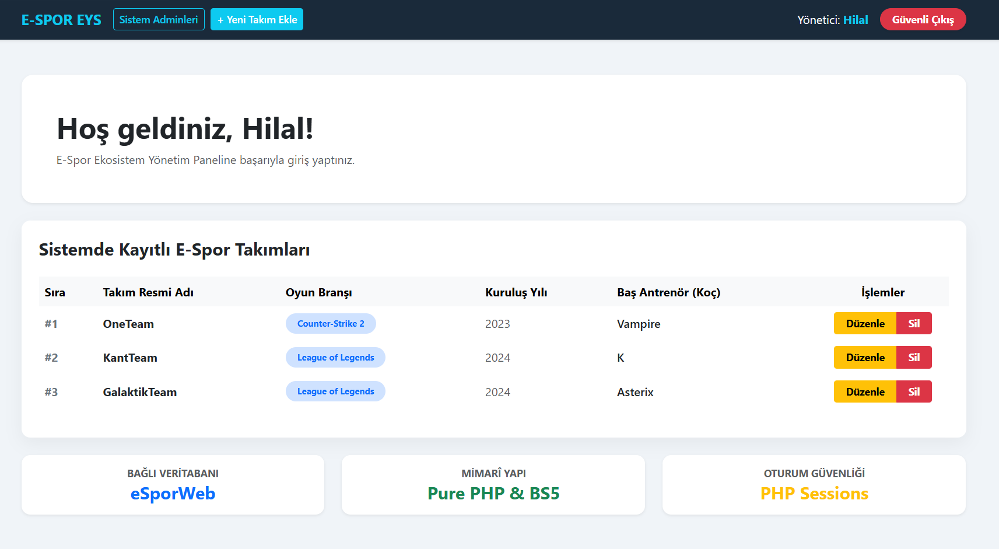

#  E-Spor Ekosistem Yönetim Sistemi (EYS)

E-Spor Ekosistem Yönetim Sistemi (EYS), hızla büyüyen e-spor sektöründeki takımları, idari kadroyu ve sistem yöneticilerini tek bir çatı altında toplamak, verileri merkezi bir yapıdan modüler olarak yönetmek amacıyla geliştirilmiş web tabanlı bir kurumsal yönetim uygulamasıdır. 

Bu proje; harici hiçbir hazır kütüphane veya framework (Laravel, CodeIgniter vb.) kullanılmadan, tamamen **yalın (pure) PHP** mimarisiyle arka uçta (backend) kodlanmış; ön uçta (frontend) ise stilsiz tek bir öge bırakılmayacak şekilde modern ve responsive **Bootstrap 5** bileşenleri ile giydirilmiştir.

---

##  Ekran Görüntüleri & Proje Videosu
* **
* *Arayüz Görseli 1:* 
* *Arayüz Görseli 2:*  
* *Video Linki: * https://drive.google.com/file/d/1xDoBmz1aRIvd_EuBb8sUKsnP6ewhxJKn/view?usp=sharing
---

##  Öne Çıkan Teknik ve Fonksiyonel Özellikler

* **Güvenli Giriş Kapısı & Şifre Kriptolama (Auth):** Sisteme yalnızca yetkili e-spor adminleri/menajerleri kayıt olup giriş yapabilir. Kullanıcı şifreleri veritabanına asla düz metin olarak kaydedilmez; PHP'nin `password_hash()` algoritmasıyla güçlü bir şekilde kriptolanarak saklanır ve `password_verify()` ile doğrulanır.
* **Oturum Güvenliği Kalkanı (Session Management):** Sistem genelinde yetkisiz erişimleri (URL üzerinden kaçak geçişleri) engellemek amacıyla düz çerezler yerine sunucu taraflı güvenli PHP `$_SESSION` yapısı kullanılmıştır. Giriş yapmayan kullanıcılar korumalı sayfalara erişemeden doğrudan `login.php`'ye fırlatılır.
* **Tam Zamanlı CRUD Döngüsü:** Yetkili kullanıcılar; e-spor takımlarını sisteme ekleyebilir (Create), tüm takımları dinamik bir tabloda listeleyebilir (Read), mevcut takım bilgilerini güncelleyebilir (Update) ve takımları sistemden tamamen silebilirler (Delete).
* **Kurumsal Yönetici (Admin) Modülü & 100+ ID Sistemi:** Sistemde aktif görev yapan tüm yöneticiler listelenebilir. MySQL veritabanı motorunda yapılan optimizasyon sayesinde her yeni yöneticiye T.C. Kimlik mantığında, `100`'den başlayarak ardışık artan (`101`, `102`...) benzersiz birer kurumsal ID tanımlanmıştır. Panelde o an aktif olan yöneticiye dinamik olarak `(Siz)` ibaresi gösterilmektedir.
* **Dinamik Arayüz Sıralaması (Sayaç Mantığı):** Takım listesinde sıra numaraları veritabanı ID'sine değil, dinamik PHP sayacına bağlıdır. Bu sayede aradan bir takım silinse dahi tablodaki ardışık sıralama (`1, 2, 3...`) asla bozulmaz.
* **Mobil Uyumlu Responsive UI (Grid Sistemi):** Karanlık ve boğucu temalar yerine iç açıcı mavimsi beyaz (`#f0f4f8`) arka plan ve kurumsal gece mavisi navbar konsepti uygulanmıştır. Bootstrap'in 12'li hayali sütun (Grid) sistemi (`.container`, `.row`, `.col-*`) sayesinde uygulama; bilgisayar, tablet ve akıllı telefon ekranlarına göre kırılma yaşamadan otomatik şekil alır.

---

##  Kullanılan Teknolojiler

* **Arka Uç (Backend):** Yalın PHP (Pure PHP - Nesne Yönelimli/Modüler Mimari)
* **Ön Uç (Frontend):** HTML5, CSS3, JavaScript ve Bootstrap 5 (Uzak Sunucu - CDN Entegrasyonu)
* **Veritabanı (Database):** MySQL / MariaDB (Karakter Seti: `utf8mb4_general_ci`)

---

##  Proje Klasör Mimarisi

```text
klasor/
│
├── index.php             --> Karşılama ve giriş durumuna göre otomatik yönlendirme yapan trafik polisi.
├── baglanti.php          --> MySQL veritabanına utf8mb4 karakter setiyle bağlanan güvenli köprü dosyası.
├── header.php            --> Master Page mimarisinin üst menü, stil ve CDN linklerini barındıran ortak kafası.
├── footer.php            --> Sayfa kapanışlarını ve JS tetikleyicilerini barındıran ortak alt şablon.
│
├── register.php          --> password_hash() kullanan şifreli kullanıcı kayıt sayfası.
├── login.php             --> Ortalanmış modern tasarımlı, session başlatan sisteme giriş kapısı.
├── logout.php            --> Sunucu hafızasını sıfırlayan (session_destroy) güvenli çıkış modülü.
│
├── dashboard.php         --> Karşılama, takım tablosu ve istatistik kartlarının yer aldığı ana yönetim paneli.
├── adminler.php          --> Kayıtlı yöneticileri 100+ kurumsal ID ile listeleyen özel ekran.
│
├── takim_ekle.php        --> Form üzerinden veritabanına yeni e-spor takımı ekleme modülü (Create).
├── takim_duzenle.php     --> Eski verileri form içinde dolu getiren güncelleme modülü (Update).
├── takim_sil.php         --> GET metoduyla gelen ID'yi yakalayıp takımı yok eden gizli tetikleyici (Delete).
│
└── AI.md                 --> Yapay zeka ile yapılan tüm teknik ve kuramsal sohbetlerin zorunlu günlüğü.
